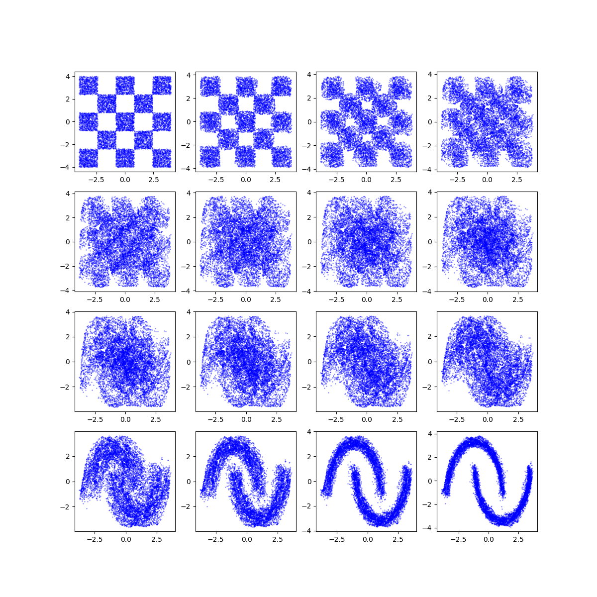
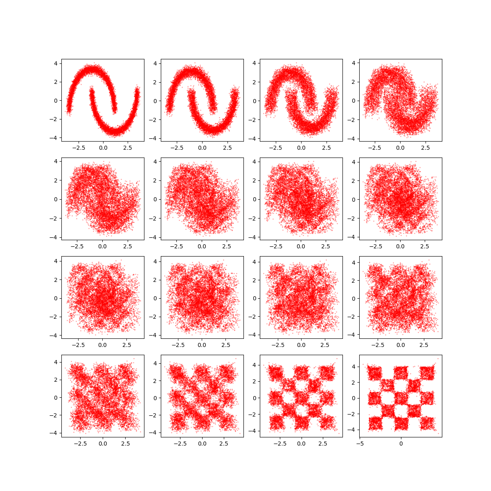

# FlowMatching for Optimal Transport

**FlowMatching for Optimal Transport** is a continuous normalizing flow model that learns the optimal transport map between two known distributions using Flow-Matching. This repository provides a modular implementation for 2D toy datasets.

The model is inspired by [Flow-based generative models as iterative algorithms in probability space](https://arxiv.org/abs/2502.13394), which interprets continuous normalizing flows as iterative solvers in distribution space.

<p align="center">
  
  
</p>

---

## Overview

FlowMatching for OT aims to directly learn a vector field $ v(x,t) $ whose flow transports particles from a source distribution $ p $ to a target distribution $ q $.
The training objective minimizes:
$
L(\hat{v}) := \int_0^1 
\mathbb{E}_{x_p, x_q}
\left\|
\hat{v}(\phi(t), t) - \frac{d}{dt}\phi(t)
\right\|^2
\, dt
$, where $\phi(t) := I_t(x_p, x_q)$ is a pre-specified
“interpolation function” .


This implementation focuses on **one-step FM** (single ODE block), learning a direct OT-like flow between $ p $ and $ q $. We set $ \frac{d}{dt}\phi(t) = x_q - x_p $ for the linear interpolation path $ \phi(t) = (1-t)x_p + t x_q $, where $x_p \sim p$ and $x_q \sim q$.

---

## Install dependencies
```bash
pip install -r requirements.txt
```
---

## Configuration
The main configuration file is located at:
```
configs/FM_OT.yaml
```
Example:
```yaml
data:
  N: 20000

model:
  ODEFunc_config: [512, 512, 512, 512]
  data_dim: 2
  h_k: 1
  h_steps: 15
  activation: softplus

training:
  batch_size: 512
  lr: 0.001
  epochs: 500
  clip_grad: 1.0
  save_path: chkpt/FM_OT.pt
  shuffle: True
```

---

## Usage
### Train the model
```bash
python train_OT.py
```
### Evaluate and visualize results
```bash
python test_OT.py
```

---

## Repository Structure
```bash
FlowMatching-OT/
├── src/
│   ├── model.py          # ODEFunc and Flow_Matching definitions
│   ├── utils.py          # Loss, interpolation
│   ├── get_data.py       # Data generation
│   └── training.py       # Training module
│
├── configs/              # Experiment configs
├── pictures/             # Figures for README
├── results/              # visualization results
├── chkpt/                # Model checkpoints
├── train_OT.py           # Main training entry point
├── test_OT.py            # Evaluation and visualization
├── requirements.txt
├── .gitignore
└── README.md
```